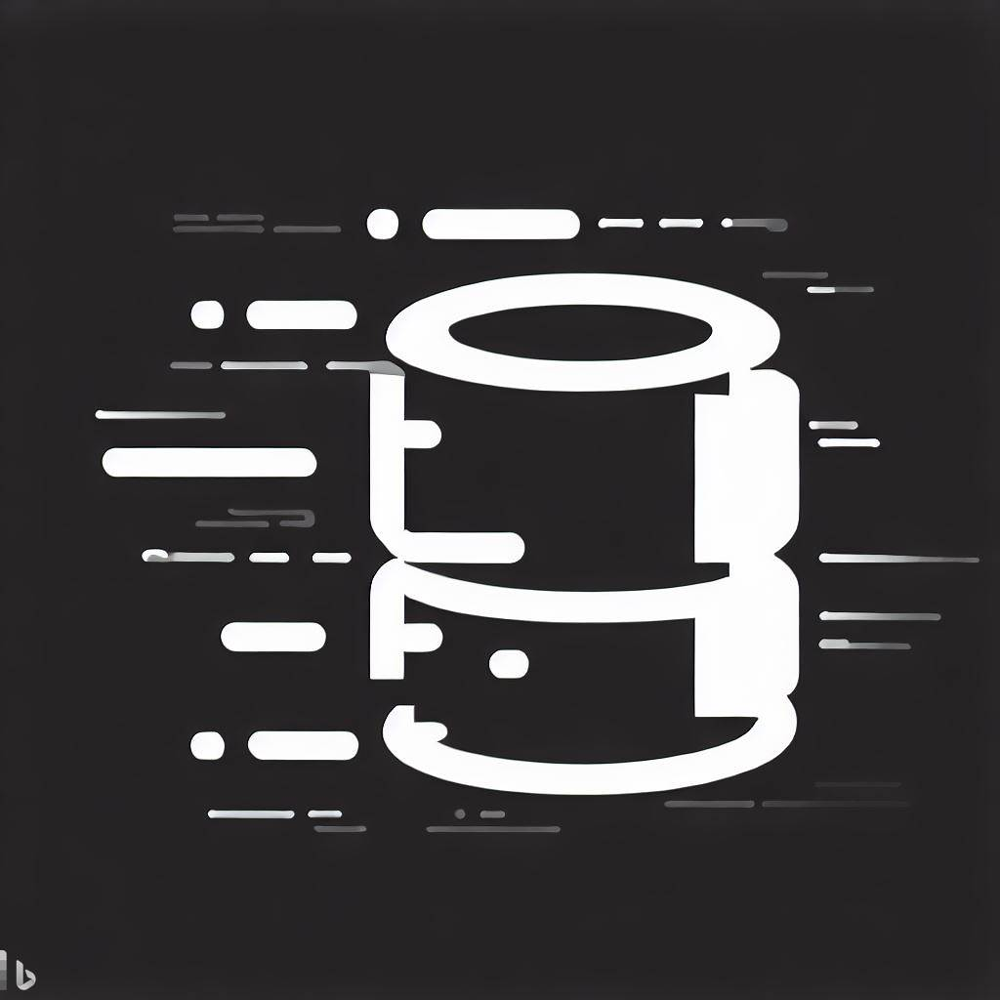

<p align="center"></p>
<h1 align="center">WarpSQL</h3>
Opinionated extensions to Postgres packaged as a single docker deployment. Why install 10 DBs when you can have everything at once (maybe not everything).

Certified as Indie Hacker's best friend!!!

### Current and future supported extensions

- [x] [PgVector](https://github.com/pgvector/pgvector)
- [x] [TimescaleDB](https://github.com/timescale/timescaledb)
- [x] [Citus](https://www.citusdata.com/)
- [x] [PostGIS](https://postgis.net)
- [x] [ZomboDB](https://github.com/zombodb/zombodb)
- [ ] [PLV8](https://github.com/plv8/plv8)
- [ ] [Pg Repack](https://github.com/reorg/pg_repack)

Bootstrapped from [TimescaleDB](https://github.com/timescale/timescaledb-docker)

### Usage with Compose

```yaml
version: '3.6'
services:
  warpsql:
    container_name: warpsql
    image: samagragovernance/postgres:latest-pg15
    restart: always
    ports:
      - "5432:5432"
    volumes:
      - ./pgdata:/var/lib/postgresql/data
    environment:
      POSTGRES_USER: warpSQLUser
      POSTGRES_PASSWORD: warpSQLPass
```

WarpSQL is a powerful solution that provides opinionated extensions to Postgres, conveniently packaged as a single Docker deployment. It eliminates the need to install multiple separate databases by offering a comprehensive set of features in one place (although not everything, as some features might not be included).

By utilizing WarpSQL, you can benefit from the following:

- *Simplified setup*: With WarpSQL, you can have all the necessary extensions for your Postgres database in one go, saving you time and effort.
- *Seamless integration*: WarpSQL includes popular extensions like PgVector, TimescaleDB, Citus, and PostGIS, allowing you to leverage their functionality seamlessly.
- *Enhanced performance*: The included extensions are carefully selected to optimize database performance, enabling you to work efficiently with large datasets.
- *Extensibility*: While WarpSQL already supports a range of extensions, it aims to expand its offerings to include even more powerful tools in the future, such as ZomboDB, PLV8, and Pg Repack.
Get started with WarpSQL today and experience the convenience of a comprehensive Postgres solution.

## AWS S3 Integration

WarpSQL also supports seamless integration with AWS S3, allowing you to store and retrieve data from your S3 buckets directly within your Postgres database. This integration offers flexibility and scalability for handling large datasets and enables efficient data transfer between your application and AWS S3.

To configure the AWS S3 integration with WarpSQL, follow these steps:


1- Create an IAM user in your AWS account with the necessary permissions to access your S3 buckets. Make sure to note down the IAM user's access key ID and secret access key.

2- Install the AWS Command Line Interface (CLI) on your local machine.


3- Configure the AWS CLI by running the following command and providing your IAM user's access key ID and secret access key:


4- In the `docker-compose.yml` file, update the `extension-tracker` service with the following configuration:

```yaml
extension-tracker:
  image: minio/mc
  volumes:
    - ./data:/data
  command: mc <your-command-here>  # Replace `<your-command-here>` with the appropriate `mc` command for interacting with S3.
  depends_on:
    - "timescaledb"
  restart: always
  environment:
    - AWS_ACCESS_KEY_ID=<your-access-key-id>  # Replace `<your-access-key-id>` with your IAM user's access key ID.
    - AWS_SECRET_ACCESS_KEY=<your-secret-access-key>  # Replace `<your-secret-access-key>` with your IAM user's secret access key.
    - AWS_DEFAULT_REGION=<your-aws-region>  # Replace `<your-aws-region>` with your desired AWS region.
```

5- Start the WarpSQL containers using Docker Compose by running the following command:


## Contribution

You can contribute to the development of WarpSQL using both Gitpod and Codespaces. Follow the steps below to set up your development environment and make contributions:

### Gitpod

Click the "Open in Gitpod" button above or use the following link:[Open in Gitpod](https://gitpod.io/new/#https://github.com/ChakshuGautam/postgres-tsdb-vector-docker)

[](https://gitpod.io/#https://github.com/ChakshuGautam/postgres-tsdb-vector-docker)

- Wait for the Gitpod environment to be created and initialized.
- Once the environment is ready, you can start working on the project.
- Make your desired changes or additions.
- Test your changes and ensure they meet the project's guidelines.
- Commit and push your changes to your forked repository.
- Create a pull request from your forked repository to the main WarpSQL repository.

### GitHub Codespaces

You can use GitHub Codespaces to develop this project in the cloud.

[](https://github.com/features/codespaces)

- Click on the "Code" button.
- Select "Open with Codespaces" from the dropdown menu.
- Choose the appropriate Codespace configuration.
- Wait for the environment to be provisioned.

Once the environment is ready, you can start working on the project.

- Make your desired changes or additions.
- Test your changes and ensure they meet the project's guidelines.
- Commit and push your changes to your forked repository.
- Create a pull request from your forked repository to the main WarpSQL repository.
- We welcome contributions from the community and appreciate your support in improving WarpSQL!

Install the project dependencies by running the following command in the terminal:

```pip install -r requirements.txt```

### Ensure CI passes 

Before merging any contributions or changes, it's essential to ensure that the continuous integration (CI) tests pass successfully. CI helps maintain code quality standards and prevents the introduction of regressions. To ensure a smooth integration process, follow these steps:

- Make your desired changes or additions to the codebase.
- Run the relevant tests locally to verify that your changes are functioning as expected.
- Push your changes to the branch you're working on.
- The CI system will automatically run tests and checks on your code.
- Monitor the CI build status to ensure that all tests pass successfully.
- If the CI build fails, review the error messages and make the necessary fixes.
- Repeat steps 3-6 until the CI build passes successfully.
- Once the CI build is successful, you can proceed with merging your changes into the main WarpSQL repository.

## Maintainers

<!-- ALL-CONTRIBUTORS-LIST:START - Do not remove or modify this section -->
<!-- prettier-ignore-start -->
<!-- markdownlint-disable -->
<table>
  <tbody>
    <tr>
      <td align="center" valign="top" width="14.28%"><br /><sub><b>Jayanth Kumar</b></sub></a><br /><a href="https://github.com/all-contributors/all-contributors/commits?author=jayanth-kumar-morem" title="Code">💻</a></td>
    </tr>
  </tbody>
</table>
<!-- markdownlint-restore -->
<!-- prettier-ignore-end -->

<!-- ALL-CONTRIBUTORS-LIST:END -->
